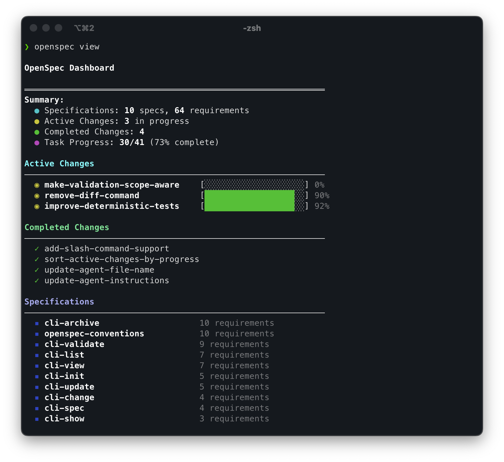

<p align="center">
  <a href="https://github.com/Fission-AI/OvseSpec">
    <picture>
      <source srcset="assets/ovsespec_pixel_dark.svg" media="(prefers-color-scheme: dark)">
      <source srcset="assets/ovsespec_pixel_light.svg" media="(prefers-color-scheme: light)">
      
    </picture>
  </a>
  
</p>
<p align="center">Spec-driven development for AI coding assistants.</p>
<p align="center">
  <a href="https://github.com/Fission-AI/OvseSpec/actions/workflows/ci.yml"></a>
  <a href="https://www.npmjs.com/package/@jn-lzw/ovsespec"></a>
  <a href="https://nodejs.org/"></a>
  <a href="./LICENSE"></a>
  <a href="https://conventionalcommits.org"></a>
  <a href="https://discord.gg/YctCnvvshC"></a>
</p>

<p align="center">
  
</p>

<p align="center">
  Follow <a href="https://x.com/0xTab">@0xTab on X</a> for updates · Join the <a href="https://discord.gg/YctCnvvshC">OvseSpec Discord</a> for help and questions.
</p>

<p align="center">
  <sub>🧪 <strong>New:</strong> <a href="docs/ovsx.md">OVSX Workflow</a> — schema-driven, hackable, fluid. Iterate on workflows without code changes.</sub>
</p>

# OvseSpec

OvseSpec aligns humans and AI coding assistants with spec-driven development so you agree on what to build before any code is written. **No API keys required.**

## Why OvseSpec?

AI coding assistants are powerful but unpredictable when requirements live in chat history. OvseSpec adds a lightweight specification workflow that locks intent before implementation, giving you deterministic, reviewable outputs.

Key outcomes:
- Human and AI stakeholders agree on specs before work begins.
- Structured change folders (proposals, tasks, and spec updates) keep scope explicit and auditable.
- Shared visibility into what's proposed, active, or archived.
- Works with the AI tools you already use: custom slash commands where supported, context rules everywhere else.

## How OvseSpec compares (at a glance)

- **Lightweight**: simple workflow, no API keys, minimal setup.
- **Brownfield-first**: works great beyond 0→1. OvseSpec separates the source of truth from proposals: `ovsespec/specs/` (current truth) and `ovsespec/changes/` (proposed updates). This keeps diffs explicit and manageable across features.
- **Change tracking**: proposals, tasks, and spec deltas live together; archiving merges the approved updates back into specs.
- **Compared to spec-kit & Kiro**: those shine for brand-new features (0→1). OvseSpec also excels when modifying existing behavior (1→n), especially when updates span multiple specs.

See the full comparison in [How OvseSpec Compares](#how-ovsespec-compares).

## How It Works

```
┌────────────────────┐
│ Draft Change       │
│ Proposal           │
└────────┬───────────┘
         │ share intent with your AI
         ▼
┌────────────────────┐
│ Review & Align     │
│ (edit specs/tasks) │◀──── feedback loop ──────┐
└────────┬───────────┘                          │
         │ approved plan                        │
         ▼                                      │
┌────────────────────┐                          │
│ Implement Tasks    │──────────────────────────┘
│ (AI writes code)   │
└────────┬───────────┘
         │ ship the change
         ▼
┌────────────────────┐
│ Archive & Update   │
│ Specs (source)     │
└────────────────────┘

1. Draft a change proposal that captures the spec updates you want.
2. Review the proposal with your AI assistant until everyone agrees.
3. Implement tasks that reference the agreed specs.
4. Archive the change to merge the approved updates back into the source-of-truth specs.
```

## Getting Started

### Supported AI Tools

<details>
<summary><strong>Native Slash Commands</strong> (click to expand)</summary>

These tools have built-in OvseSpec commands. Select the OvseSpec integration when prompted.

| Tool | Commands |
|------|----------|
| **Amazon Q Developer** | `@ovsespec-proposal`, `@ovsespec-apply`, `@ovsespec-archive` (`.amazonq/prompts/`) |
| **Antigravity** | `/ovsespec-proposal`, `/ovsespec-apply`, `/ovsespec-archive` (`.agent/workflows/`) |
| **Auggie (Augment CLI)** | `/ovsespec-proposal`, `/ovsespec-apply`, `/ovsespec-archive` (`.augment/commands/`) |
| **Claude Code** | `/ovsespec:proposal`, `/ovsespec:apply`, `/ovsespec:archive` |
| **Cline** | Workflows in `.clinerules/workflows/` directory (`.clinerules/workflows/ovsespec-*.md`) |
| **CodeBuddy Code (CLI)** | `/ovsespec:proposal`, `/ovsespec:apply`, `/ovsespec:archive` (`.codebuddy/commands/`) — see [docs](https://www.codebuddy.ai/cli) |
| **Codex** | `/ovsespec-proposal`, `/ovsespec-apply`, `/ovsespec-archive` (global: `~/.codex/prompts`, auto-installed) |
| **Continue** | `/ovsespec-proposal`, `/ovsespec-apply`, `/ovsespec-archive` (`.continue/prompts/`) |
| **CoStrict** | `/ovsespec-proposal`, `/ovsespec-apply`, `/ovsespec-archive` (`.cospec/ovsespec/commands/`) — see [docs](https://costrict.ai)|
| **Crush** | `/ovsespec-proposal`, `/ovsespec-apply`, `/ovsespec-archive` (`.crush/commands/ovsespec/`) |
| **Cursor** | `/ovsespec-proposal`, `/ovsespec-apply`, `/ovsespec-archive` |
| **Factory Droid** | `/ovsespec-proposal`, `/ovsespec-apply`, `/ovsespec-archive` (`.factory/commands/`) |
| **Gemini CLI** | `/ovsespec:proposal`, `/ovsespec:apply`, `/ovsespec:archive` (`.gemini/commands/ovsespec/`) |
| **GitHub Copilot** | `/ovsespec-proposal`, `/ovsespec-apply`, `/ovsespec-archive` (`.github/prompts/`) |
| **iFlow (iflow-cli)** | `/ovsespec-proposal`, `/ovsespec-apply`, `/ovsespec-archive` (`.iflow/commands/`) |
| **Kilo Code** | `/ovsespec-proposal.md`, `/ovsespec-apply.md`, `/ovsespec-archive.md` (`.kilocode/workflows/`) |
| **OpenCode** | `/ovsespec-proposal`, `/ovsespec-apply`, `/ovsespec-archive` |
| **Qoder** | `/ovsespec:proposal`, `/ovsespec:apply`, `/ovsespec:archive` (`.qoder/commands/ovsespec/`) — see [docs](https://qoder.com) |
| **Qwen Code** | `/ovsespec-proposal`, `/ovsespec-apply`, `/ovsespec-archive` (`.qwen/commands/`) |
| **RooCode** | `/ovsespec-proposal`, `/ovsespec-apply`, `/ovsespec-archive` (`.roo/commands/`) |
| **Windsurf** | `/ovsespec-proposal`, `/ovsespec-apply`, `/ovsespec-archive` (`.windsurf/workflows/`) |

Kilo Code discovers team workflows automatically. Save the generated files under `.kilocode/workflows/` and trigger them from the command palette with `/ovsespec-proposal.md`, `/ovsespec-apply.md`, or `/ovsespec-archive.md`.

</details>

<details>
<summary><strong>AGENTS.md Compatible</strong> (click to expand)</summary>

These tools automatically read workflow instructions from `ovsespec/AGENTS.md`. Ask them to follow the OvseSpec workflow if they need a reminder. Learn more about the [AGENTS.md convention](https://agents.md/).

| Tools |
|-------|
| Amp • Jules • Others |

</details>

### Install & Initialize

#### Prerequisites
- **Node.js >= 20.19.0** - Check your version with `node --version`

#### Step 1: Install the CLI globally

**Option A: Using npm**

```bash
npm install -g @jn-lzw/ovsespec@latest
```

Verify installation:
```bash
ovsespec --version
```

**Option B: Using Nix (NixOS and Nix package manager)**

Run OvseSpec directly without installation:
```bash
nix run github:Fission-AI/OvseSpec -- init
```

Or install to your profile:
```bash
nix profile install github:Fission-AI/OvseSpec
```

Or add to your development environment in `flake.nix`:
```nix
{
  inputs = {
    nixpkgs.url = "github:NixOS/nixpkgs/nixos-unstable";
    ovsespec.url = "github:Fission-AI/OvseSpec";
  };

  outputs = { nixpkgs, ovsespec, ... }: {
    devShells.x86_64-linux.default = nixpkgs.legacyPackages.x86_64-linux.mkShell {
      buildInputs = [ ovsespec.packages.x86_64-linux.default ];
    };
  };
}
```

Verify installation:
```bash
ovsespec --version
```

#### Step 2: Initialize OvseSpec in your project

Navigate to your project directory:
```bash
cd my-project
```

Run the initialization:
```bash
ovsespec init
```

**What happens during initialization:**
- You'll be prompted to pick any natively supported AI tools (Claude Code, CodeBuddy, Cursor, OpenCode, Qoder,etc.); other assistants always rely on the shared `AGENTS.md` stub
- OvseSpec automatically configures slash commands for the tools you choose and always writes a managed `AGENTS.md` hand-off at the project root
- A new `ovsespec/` directory structure is created in your project

**After setup:**
- Primary AI tools can trigger `/ovsespec` workflows without additional configuration
- Run `ovsespec list` to verify the setup and view any active changes
- If your coding assistant doesn't surface the new slash commands right away, restart it. Slash commands are loaded at startup,
  so a fresh launch ensures they appear

### Optional: Populate Project Context

After `ovsespec init` completes, you'll receive a suggested prompt to help populate your project context:

```text
Populate your project context:
"Please read ovsespec/project.md and help me fill it out with details about my project, tech stack, and conventions"
```

Use `ovsespec/project.md` to define project-level conventions, standards, architectural patterns, and other guidelines that should be followed across all changes.

### Create Your First Change

Here's a real example showing the complete OvseSpec workflow. This works with any AI tool. Those with native slash commands will recognize the shortcuts automatically.

#### 1. Draft the Proposal
Start by asking your AI to create a change proposal:

```text
You: Create an OvseSpec change proposal for adding profile search filters by role and team
     (Shortcut for tools with slash commands: /ovsespec:proposal Add profile search filters)

AI:  I'll create an OvseSpec change proposal for profile filters.
     *Scaffolds ovsespec/changes/add-profile-filters/ with proposal.md, tasks.md, spec deltas.*
```

#### 2. Verify & Review
Check that the change was created correctly and review the proposal:

```bash
$ ovsespec list                             # Confirm the change folder exists
$ ovsespec validate add-profile-filters     # Validate spec formatting
$ ovsespec show add-profile-filters         # Review proposal, tasks, and spec delta
```

#### 3. Refine the Specs
Iterate on the specifications until they match your needs:

```text
You: Can you add acceptance criteria for the role and team filters?

AI:  I'll update the spec delta with scenarios for role and team filters.
     *Edits ovsespec/changes/add-profile-filters/specs/profile/spec.md and tasks.md.*
```

#### 4. Implement the Change
Once specs look good, start implementation:

```text
You: The specs look good. Let's implement this change.
     (Shortcut for tools with slash commands: /ovsespec:apply add-profile-filters)

AI:  I'll work through the tasks in the add-profile-filters change.
     *Implements tasks from ovsespec/changes/add-profile-filters/tasks.md*
     *Marks tasks complete: Task 1.1 ✓, Task 1.2 ✓, Task 2.1 ✓...*
```

#### 5. Archive the Completed Change
After implementation is complete, archive the change:

```text
AI:  All tasks are complete. The implementation is ready.

You: Please archive the change
     (Shortcut for tools with slash commands: /ovsespec:archive add-profile-filters)

AI:  I'll archive the add-profile-filters change.
    *Runs: ovsespec archive add-profile-filters --yes*
     ✓ Change archived successfully. Specs updated. Ready for the next feature!
```

Or run the command yourself in terminal:
```bash
$ ovsespec archive add-profile-filters --yes  # Archive the completed change without prompts
```

**Note:** Tools with native slash commands (Claude Code, CodeBuddy, Cursor, Codex, Qoder, RooCode) can use the shortcuts shown. All other tools work with natural language requests to "create an OvseSpec proposal", "apply the OvseSpec change", or "archive the change".

## Command Reference

```bash
ovsespec list               # View active change folders
ovsespec view               # Interactive dashboard of specs and changes
ovsespec show <change>      # Display change details (proposal, tasks, spec updates)
ovsespec validate <change>  # Check spec formatting and structure
ovsespec archive <change> [--yes|-y]   # Move a completed change into archive/ (non-interactive with --yes)
```

## Example: How AI Creates OvseSpec Files

When you ask your AI assistant to "add two-factor authentication", it creates:

```
ovsespec/
├── specs/
│   └── auth/
│       └── spec.md           # Current auth spec (if exists)
└── changes/
    └── add-2fa/              # AI creates this entire structure
        ├── proposal.md       # Why and what changes
        ├── tasks.md          # Implementation checklist
        ├── design.md         # Technical decisions (optional)
        └── specs/
            └── auth/
                └── spec.md   # Delta showing additions
```

### AI-Generated Spec (created in `ovsespec/specs/auth/spec.md`):

```markdown
# Auth Specification

## Purpose
Authentication and session management.

## Requirements
### Requirement: User Authentication
The system SHALL issue a JWT on successful login.

#### Scenario: Valid credentials
- WHEN a user submits valid credentials
- THEN a JWT is returned
```

### AI-Generated Change Delta (created in `ovsespec/changes/add-2fa/specs/auth/spec.md`):

```markdown
# Delta for Auth

## ADDED Requirements
### Requirement: Two-Factor Authentication
The system MUST require a second factor during login.

#### Scenario: OTP required
- WHEN a user submits valid credentials
- THEN an OTP challenge is required
```

### AI-Generated Tasks (created in `ovsespec/changes/add-2fa/tasks.md`):

```markdown
## 1. Database Setup
- [ ] 1.1 Add OTP secret column to users table
- [ ] 1.2 Create OTP verification logs table

## 2. Backend Implementation  
- [ ] 2.1 Add OTP generation endpoint
- [ ] 2.2 Modify login flow to require OTP
- [ ] 2.3 Add OTP verification endpoint

## 3. Frontend Updates
- [ ] 3.1 Create OTP input component
- [ ] 3.2 Update login flow UI
```

**Important:** You don't create these files manually. Your AI assistant generates them based on your requirements and the existing codebase.

## Understanding OvseSpec Files

### Delta Format

Deltas are "patches" that show how specs change:

- **`## ADDED Requirements`** - New capabilities
- **`## MODIFIED Requirements`** - Changed behavior (include complete updated text)
- **`## REMOVED Requirements`** - Deprecated features

**Format requirements:**
- Use `### Requirement: <name>` for headers
- Every requirement needs at least one `#### Scenario:` block
- Use SHALL/MUST in requirement text

## How OvseSpec Compares

### vs. spec-kit
OvseSpec’s two-folder model (`ovsespec/specs/` for the current truth, `ovsespec/changes/` for proposed updates) keeps state and diffs separate. This scales when you modify existing features or touch multiple specs. spec-kit is strong for greenfield/0→1 but provides less structure for cross-spec updates and evolving features.

### vs. Kiro.dev
OvseSpec groups every change for a feature in one folder (`ovsespec/changes/feature-name/`), making it easy to track related specs, tasks, and designs together. Kiro spreads updates across multiple spec folders, which can make feature tracking harder.

### vs. No Specs
Without specs, AI coding assistants generate code from vague prompts, often missing requirements or adding unwanted features. OvseSpec brings predictability by agreeing on the desired behavior before any code is written.

## Team Adoption

1. **Initialize OvseSpec** – Run `ovsespec init` in your repo.
2. **Start with new features** – Ask your AI to capture upcoming work as change proposals.
3. **Grow incrementally** – Each change archives into living specs that document your system.
4. **Stay flexible** – Different teammates can use Claude Code, CodeBuddy, Cursor, or any AGENTS.md-compatible tool while sharing the same specs.

Run `ovsespec update` whenever someone switches tools so your agents pick up the latest instructions and slash-command bindings.

## Updating OvseSpec

1. **Upgrade the package**
   ```bash
   npm install -g @jn-lzw/ovsespec@latest
   ```
2. **Refresh agent instructions**
   - Run `ovsespec update` inside each project to regenerate AI guidance and ensure the latest slash commands are active.

## Experimental Features

<details>
<summary><strong>🧪 OVSX: Fluid, Iterative Workflow</strong> (Claude Code only)</summary>

**Why this exists:**
- Standard workflow is locked down — you can't tweak instructions or customize
- When AI output is bad, you can't improve the prompts yourself
- Same workflow for everyone, no way to match how your team works

**What's different:**
- **Hackable** — edit templates and schemas yourself, test immediately, no rebuild
- **Granular** — each artifact has its own instructions, test and tweak individually
- **Customizable** — define your own workflows, artifacts, and dependencies
- **Fluid** — no phase gates, update any artifact anytime

```
You can always go back:

  proposal ──→ specs ──→ design ──→ tasks ──→ implement
     ▲           ▲          ▲                    │
     └───────────┴──────────┴────────────────────┘
```

| Command | What it does |
|---------|--------------|
| `/ovsx:new` | Start a new change |
| `/ovsx:continue` | Create the next artifact (based on what's ready) |
| `/ovsx:ff` | Fast-forward (all planning artifacts at once) |
| `/ovsx:apply` | Implement tasks, updating artifacts as needed |
| `/ovsx:archive` | Archive when done |

**Setup:** `ovsespec experimental`

[Full documentation →](docs/ovsx.md)

</details>

<details>
<summary><strong>Telemetry</strong> – OvseSpec collects anonymous usage stats (opt-out: <code>OVSESPEC_TELEMETRY=0</code>)</summary>

We collect only command names and version to understand usage patterns. No arguments, paths, content, or PII. Automatically disabled in CI.

**Opt-out:** `export OVSESPEC_TELEMETRY=0` or `export DO_NOT_TRACK=1`

</details>

## Contributing

- Install dependencies: `pnpm install`
- Build: `pnpm run build`
- Test: `pnpm test`
- Develop CLI locally: `pnpm run dev` or `pnpm run dev:cli`
- Conventional commits (one-line): `type(scope): subject`

<details>
<summary><strong>Maintainers & Advisors</strong></summary>

See [MAINTAINERS.md](MAINTAINERS.md) for the list of core maintainers and advisors who help guide the project.

</details>

## License

MIT
